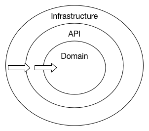
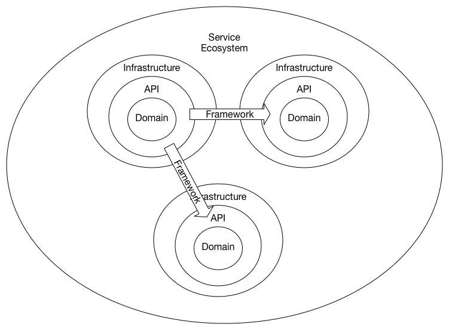
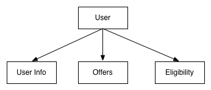

# Microservices with Ports & Adaptors


## Intent

Allow a system to be developed and tested in isolation from its eventual run-time deployment, services and databases.

## Challenge

At Credit Karma, we have been in the process of decomposing our monolithic PHP application into services.  I have been advising many of the teams working on their specific domain of the system.  Many times these teams immediately represent their domain as a system composed of several microservices.

This solves the eventual goal of self contained, single responsibility modules that can be easily deployed independently.  However, this typically results in having to start several Docker containers in order to run the entire system.  This design makes it difficult to maintain the system and run integration tests without some kind of orchestration to make it easier.

What if systems were designed to be easily ran as a single process and deployed as independent microservices in production.  If systems were designed with clear separation of concerns, proper APIs and injectable external dependencies, we could run the entire system as a single process.  Then, simply replace the API interaction with a lightweight microservice framework and deploy the ecosystem as separate services.

## An alternative design

If you have spent much time at all researching software design and architecture you have bound to come across the Onion Architecture.  The Onion Architecture relies heavily on the [Dependency Inversion principle](https://en.wikipedia.org/wiki/Dependency_inversion_principle).  The application core needs implementation of core interfaces, and if those implementing classes reside at the edges of the application, we need some mechanism for injecting that code at runtime so the application can do something useful.

### Manage coupling

The main premise is that it controls coupling.  The fundamental rule is that all code can depend on layers more central, but code cannot depend on layers further out from the core.  



### Ports and Adaptors

This architecture uses the Ports and Adapters model as the mechanism for injecting the infrastructure specific implementation at runtime.  This supports externalizing infrastructure and writing adapter code so that the infrastructure does not become tightly coupled to the domain.

#### Key Concepts
* Ports are interfaces
* Adapters are implementations
* Infrastructure injects adapters at runtime

#### Domain
* Single Purpose
* Focus on unit testing
* No side effects

#### Infrastructure
* Injects adapters at runtime
* Manage Side effects


By taking advantage of this architecture it allows us to decouple the application's core logic from the services it uses. This allows different services to be "plugged in", and it allows the application to run without these services.

In a strict sense of this architecture even the application's framework is a set of services. The core logic of an application should not depend on these services in this architecture (so that it becomes "framework agnostic").

If each significant part of the system is designed as a package following the Onion Architecture and interact with each other via their API interfaces, the API implementation can be injected via the infrastructure.  This supports a in process API implementation for development and testing and an out of process API implementation, i.e. microservices!




## Solution

To illustrate how this architecture can be designed and implemented in Scala I have created an open source project as a reference.  It's a [recommendation system](https://github.com/nnance/krs-scala) composed of three major components:

* Partner Package - Data access service that retrieves offers from partners
* Eligibility Package - Domain service that has a basic rules engine to filter offers based on a given user
* User Package - Aggregation service that returns the user and eligible offers



### Domain Design

I initially implemented the system as a singular monolith using the Ports and Adapters model to insure external dependencies didn't bleed into the core domain logic.  

#### TDD

As a long time fan of  [TDD](https://en.wikipedia.org/wiki/Test-driven_development), this design allowed me to incrementally implement the domain logic and easily validate it.  [SBT](https://en.wikipedia.org/wiki/SBT_(software) has a useful TDD feature that watches for changes in the source and incrementally compiles the changes and run the test suite

```sh
> sbt ~test
```

The domain makes use of the powerful Scala type system to achieve some key functional programming design concepts:

* Immutability
* Pure functions
* Separation of data implementation

#### Scala Type System
The eligibility engine uses case classes to apply rules to specific offer types.  This makes it easy to reason about and extend the rules and how they are used in a single place in the code.

```scala
sealed trait Rule
case class CreditScoreRange(val range: Range) extends Rule
case class MaxLoanAmount(val amount: Double) extends Rule

trait OffersDomain {
  sealed trait EligibilityRule[T] {
    def isEligible(user: User, rule: T): Boolean
  }
}

object OfferSystem extends OffersDomain {
  ...
  def isEligible(user: User, offer: Offer): Boolean = {
    offer match {
      case cc: CreditCard => ...
      case pl: PersonalLoan => ...
    }
  }
}
```

#### External Dependencies
The external dependencies were limited to data stored in the file system where I implemented an in memory repository for testing and a file system repository for runtime.  

The infrastructure module injects a specific instance of the repository:

```scala
trait InfrastructureModule { this: DomainModule =>
  val partnerRepository = PartnerRepositoryMemory()
}
```

#### Decomposition
Once I had a working monolith, I refactored the system into separate packages that would allow the system to be easily scaled out.  Each package used the Onion architecture and Ports and Adapters pattern to decouple the domain via API interfaces.

I settled on the following packages:

* eligibility
* partner
* user

By continuing to maintain solid abstractions in the API, I was able to continue to easily test the entire system while refactoring it.  

## Microservice framework
With a working system decomposed into individual packages wrapped in APIs, it was pretty straight forward to implement a microservice runtime environment.  I selected the microservice stack deployed at Credit Karma:

* **Finagle** - Twitters' RPC System used to construct high-concurrency servers on the JVM.
* **Thrift** - Framework for scalable cross-language services development
* **Scrooge** - Scrooge is a thrift code generator written in Scala
* **Finch** - Scala library for building Finagle HTTP services

#### Thrift
The services were defined in Thrift IDL to allow Scrooge to generate Finagle client and server code.  

```thrift
struct PartnerOffer {
  1: required string provider;
  2: optional i32 minimumCreditScore;
  3: optional i32 maximumCreditScore;
}

service PartnerService {
  list<PartnerOffer> getOffers(1: i32 creditScore);
}
```

#### Finagle
Each service implements the interface generated by Scrooge using the Finagle framework and translating the Domain classes to the Scrooge generated Thrift structures.

```scala
def getUser(id: Int) = {
  val user: User = api.getUser(id) match {
    case Some(u) => User(u.id, u.name, u.creditScore, Option(u.outstandingLoanAmount))
    case None => throw UserNotFound(id)
  }
  Future.value(user)
}
```

This allows the service dependencies to be replaced with Finagle clients that communicate out of process to the external services.

#### Finch

One drawback of using an RPC framework is validation via http commands with curl or a similar client.  

## Outcome

As you review the project implementation notice how the microservice framework stack (Finagle & Thrift) doesn't show
